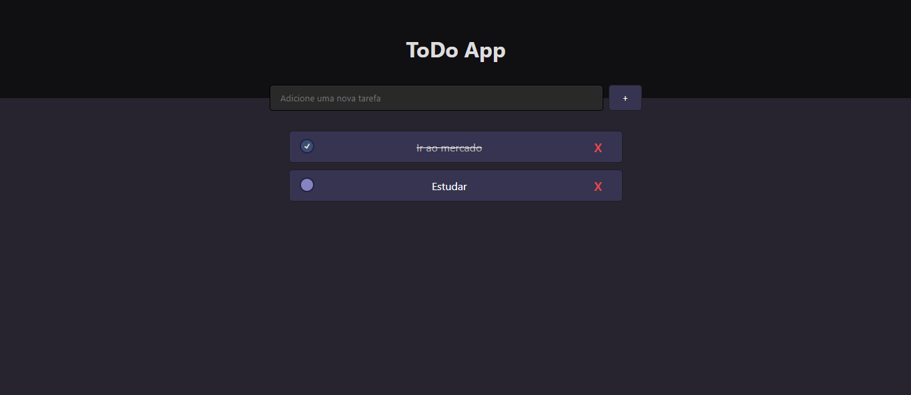

<h1 align="center"> ToDo App </h1>

Usando os conhecimentos de HTML, CSS e Javascript, fui capaz de desenvolver esse app de ToDo List. Ele é simples, atualmente criar uma nova tarefa somente com o nome dela, pode marca-la como concluída, deleta-la. Tudo isso é armazenado no Local Storage do navegador, sem o uso de banco de dados. Futuramente penso em evoluir esse projeto, trazer campos que o usuário possa adicionar Descrição de tarefa, data de tarefa, ordenar (por nome, data, conclusão, criado por ultimo, e afins), e filtros também (Concluídas, não concluídas, de uma categoria específica, e afins).

 

  

 